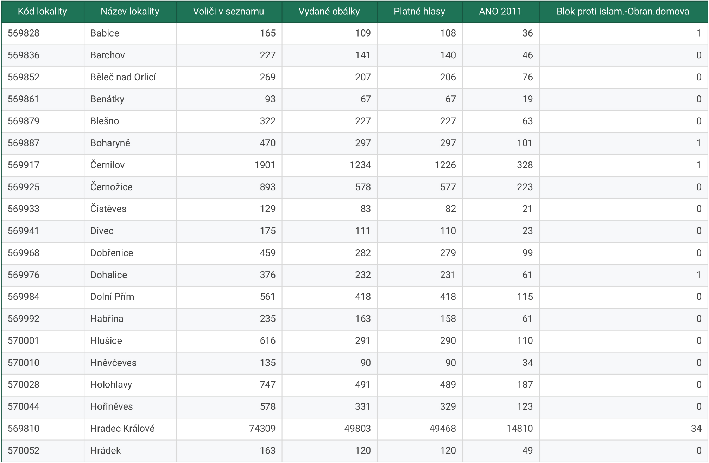

# Engeto Elections Scraper projekt

Třetí projekt pro Engeto Academy – Datový analytik s Pythonem.

## Popis projektu

Tento projekt slouží k extrahování volebních výsledků z parlamentních voleb roku 2017.  
Oficiální stránka s výsledky je [zde](https://www.volby.cz/pls/ps2017nss/ps3?xjazyk=CZ).

## Instalace knihoven

Knihovny použité v kódu jsou uvedeny v souboru *requirements.txt*.  
Doporučuji vytvořit si nové virtuální prostředí a nainstalovat knihovny následovně:

```bash
# ověřím verzi správce balíčků
pip --version

# nainstaluji knihovny ze souboru
pip install -r requirements.txt
```

## Spuštění projektu

Spuštění programu `Elections_scraper.py` v rámci příkazového řádku požaduje dva povinné argumenty:

```bash
python Elections_scraper.py <odkaz-na-seznam-obcí> <výsledný-soubor.csv>
```

Například:

```bash
python Elections_scraper.py "https://www.volby.cz/pls/ps2017nss/ps32?xjazyk=CZ&xkraj=8&xnumnuts=5201" "Hradec_Kralove_vysledky.csv"
```

Následně se stáhnou výsledky jako soubor s příponou `.csv`.

## Ukázka projektu

Výsledky hlasování pro okres **Hradec Králové**:

- **1. argument:**  
  `https://www.volby.cz/pls/ps2017nss/ps32?xjazyk=CZ&xkraj=8&xnumnuts=5201`

- **2. argument:**  
  `Hradec_Kralove_vysledky.csv`

### Spuštění programu:

```bash
python Elections_scraper.py "https://www.volby.cz/pls/ps2017nss/ps32?xjazyk=CZ&xkraj=8&xnumnuts=5201" "Hradec_Kralove_vysledky.csv"
```

### Průběh stahování:

```bash
STAHUJI DATA Z VYBRANÉHO URL: https://www.volby.cz/pls/ps2017nss/ps32?xjazyk=CZ&xkraj=8&xnumnuts=5201
UKLÁDÁM DO SOUBORU: Hradec_Kralove_vysledky.csv
UKONČUJI Elections Scraper
```

### Částečný výstup:

```bash
Kód lokality,Název lokality,Voliči v seznamu,Vydané obálky,Platné hlasy,ANO...
569828,Babice,165,109,108,36,1,0,0,0,19,2,0,7,1,0,0,0,0,0,7,0,0,3,12,9,6,4,1
569836,Barchov,227,141,140,46,0,0,1,1,16,3,0,21,2,0,0,1,1,0,5,1,2,2,6,4,19,9,0
...
```

## Náhled výsledné tabulky



## Kontakt

📧 [romanabelohoubkova@gmail.com](mailto:romanabelohoubkova@gmail.com)  
💬 Discord: Romana.B
